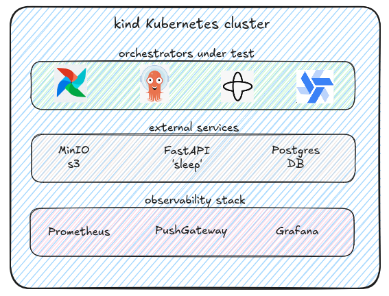

# Orchestrator Benchmark Suite

> **A comprehensive performance comparison of modern workflow orchestration platforms on Kubernetes**


---

## Overview

This project provides a **production-grade benchmarking framework** to compare four leading workflow orchestration platforms:

- **Apache Airflow** (the market-leading solution, community contributions)
- **Argo Workflows** (the Kubernetes-native solution, lightweight and efficient)
- **Windmill** (the best UI/UX 'developer-friendly' orchestrator, robust and lightweight too, which redefines the boundaries of the orchestration field)
- **Temporal.io** (Durable execution with distributed workflows, robust, full as-code, and original concept... the 'kit' DIY orchestrator)

with a comprehensive observability stack, running on a local Kubernetes Kind cluster.

Currently, the benchmark evaluates these orchestrators across :
- **CPU-intensive** tasks (scenario 1) 
- versus **I/O-bound** workloads (scenario 2 a & 2 b)

but also:
- **workers up** setup (permanent workers, near to the Temporal and Windmill paradigm)
- versus **ephemeral workers** setup (ephemeral pod for each task, near to the Argo Workflow paradigm) [TODO , not achieved]

and also, for scenario 2 :
- **variant scenario 2 a** : all the tasks are bash scripts that launch itself python scritps (equality setup with Argo Workflow)
- versus **variant scenario 2 b** : purely python scripts, according to the natural paradigm of each orchestrator (Argo Workflow is excluded form this benchmark variant)

[TODO] A synthetical table with all the scenarios and variants...


---

## Architecture at a Glance




---

## Key Features

- **3 Benchmark Scenarios**
  - **Scenario 1**: CPU-intensive Monte Carlo simulations (1 task, 4 tasks)
  - **Scenario 2A**: I/O-bound data pipeline with bash subprocess (4 sequential tasks)
  - **Scenario 2B**: I/O-bound data pipeline with pure Python (4 sequential tasks)

- **Comprehensive Metrics Collection**
  - Scheduling delay
  - Execution duration
  - End-to-end latency
  - CPU & Memory usage (permanent + worker pods)

- **Full Observability**
  - Prometheus monitoring (5-second scrape intervals)
  - Grafana dashboards for real-time visualization
  - PushGateway for custom metrics

- **Production-Ready Infrastructure**
  - Multi-orchestrator deployment on Kubernetes (one by one)
  - External PostgreSQL and MinIO S3 storage, external fastAPI service for 'real world' scenario 2
  - Custom Docker images for each orchestrator with identical python source code (scenario 1 & scenario 2 a)
  - Jupyter notebooks for results analysis

---

## Quick Start

### Prerequisites

- Docker Desktop or Docker Engine
- Kind (Kubernetes in Docker)
- kubectl CLI
- Helm 3.x
- Python 3.11+

### Installation

Follow the complete installation guide in our documentation:

**[Installation Guide](docs/GLOBAL_INSTALLATION.md)** - Complete step-by-step setup instructions

Or for a quick overview:

```bash
# 1. Create Kind cluster
export DATA_PATH="${PWD}/data"
envsubst < config_cluster.yaml | kind create cluster --config=-

# 2. Deploy observability stack
cd observability-stack
helm repo add kube-prometheus-stack https://prometheus-community.github.io/helm-charts
helm dependency build
helm install observability-stack . -n observ-stack --create-namespace --values values.yaml

# 3. Setup external services
cd ../external_databases
helm install external-db . -n external-db --create-namespace --values values.yaml

# 4. Deploy orchestrators (see detailed docs for each)
```

---

## Documentation Structure

Our documentation is organized into focused guides:

| Document | Description |
|----------|-------------|
| **[Installation Guide](docs/GLOBAL_INSTALLATION.md)** | Complete setup instructions for the cluster and all components |
| **[Orchestrators Setup](docs/ORCHESTRATORS_INSTALLATION.md)** | Detailed deployment guides for Airflow, Argo, Windmill, and Temporal |
| **[Benchmark Scenarios](docs/SCENARIOS.md)** | In-depth explanation of each benchmark scenario and workload |
| **[Observability Setup](docs/OBSERVABILITY.md)** | Configure Prometheus, Grafana, and metrics collection |
| **[Results Analysis](docs/RESULTS.md)** | Analyze benchmark results and use Jupyter notebooks |
| **[Architecture Details](docs/ARCHITECTURE.md)** | Technical architecture and design decisions |
| **[Troubleshooting](docs/TROUBLESHOOTING.md)** | Common issues and solutions |

---

## Benchmark Scenarios

### Scenario 1: CPU-Intensive (Monte Carlo)
Pure computational workload calculating Pi using Monte Carlo simulation with 20 million iterations.

**Variants:**
- 1-task workflow
- 4-task sequential workflow

**Schedule:** Every 5 minutes (`*/5 * * * *`)

### Scenario 2A: I/O-Bound (Bash Subprocess)
Real-world data pipeline with S3, PostgreSQL, and external API integration using bash scripts.

**Tasks:**
1. Delete S3 objects & drop PostgreSQL tables
2. S3 ingestion with DuckDB computation
3. Wait for external FastAPI service (60s)
4. Copy S3 data to PostgreSQL

**Schedule:** Every 5 minutes with 1-12 parallel instances

### Scenario 2B: I/O-Bound (Pure Python)
Same pipeline as 2A but with pure Python activities (no subprocess overhead).

---

## Metrics Collected

All tasks push metrics to Prometheus PushGateway:

| Metric | Description |
|--------|-------------|
| `benchmark_scheduling_delay_seconds` | Delay from scheduled time to actual start |
| `benchmark_execution_duration_seconds` | Task execution time |
| `benchmark_end_to_end_latency_seconds` | Total time from schedule to completion |
| CPU & Memory usage | Resource consumption per orchestrator |

View real-time metrics in Grafana dashboards at `http://localhost:3000`

---

## Project Structure

```
benchmark-orchestrators/
├── README.md                          # This file
├── docs/                              # Detailed documentation
├── config_cluster.yaml                # Kind cluster configuration
├── bench-python-project/              # Core benchmark task definitions
├── temporal-code/                     # Temporal.io implementation
├── windmill-code/                     # Windmill scripts & workflows
├── data/
│   ├── airflow-dag-code/              # Airflow DAG definitions
│   └── temporal-schedules/            # Temporal schedule definitions
├── orchestrators-helm-deployments/    # Kubernetes deployment configs
│   ├── airflow/
│   ├── windmill/
│   ├── argo_workflow/
│   └── temporal/
├── docker-orchestrator-factory/       # Custom Docker images
├── external_databases/                # PostgreSQL & MinIO S3
├── external_fastapi_service/          # External service for I/O testing
├── observability-stack/               # Prometheus, Grafana, PushGateway
├── benchmark-results-analysis/        # Results CSV and Jupyter notebooks
└── grafana-backup/                    # Pre-configured Grafana dashboards
```

---

## Results & Analysis

After running benchmarks, analyze results using Jupyter notebooks:

```bash
cd benchmark-results-analysis
jupyter notebook results_dynamic_chart.ipynb
```

Raw results are stored in `benchmark-results-analysis/result/bench_raw_results.csv`

For detailed analysis guidance, see **[Results Analysis Guide](docs/RESULTS.md)**

---

## Technology Stack

**Orchestrators:**
- Apache Airflow 3.0.2 (CeleryExecutor)
- Argo Workflows 0.45.26
- Windmill (latest)
- Temporal.io (latest)

**Infrastructure:**
- Kubernetes Kind cluster
- Helm 3.x for deployments
- Docker for container images

**Observability:**
- Prometheus (5s scrape interval)
- Grafana (dashboards)
- Prometheus PushGateway

**Languages:**
- Python 3.11+ (benchmark tasks)
- Bash (workflow orchestration)

**External Services:**
- PostgreSQL 15
- MinIO S3
- FastAPI

---

## Contributing

Contributions are welcome! Please:

1. Fork the repository
2. Create a feature branch
3. Make your changes
4. Submit a pull request

---

## License

This project is provided as-is for educational and benchmarking purposes.

---

## Next Steps

1. **[Follow the Installation Guide](docs/GLOBAL_INSTALLATION.md)** to set up your environment
2. **[Deploy your first orchestrator](docs/ORCHESTRATORS_INSTALLATION.md)**
3. **[Run benchmark scenarios](docs/SCENARIOS.md)**
4. **[Analyze the results](docs/RESULTS.md)**

---

<div align="center">

**Happy Benchmarking!**

If you find this project useful, please consider giving it a star ⭐

</div>
